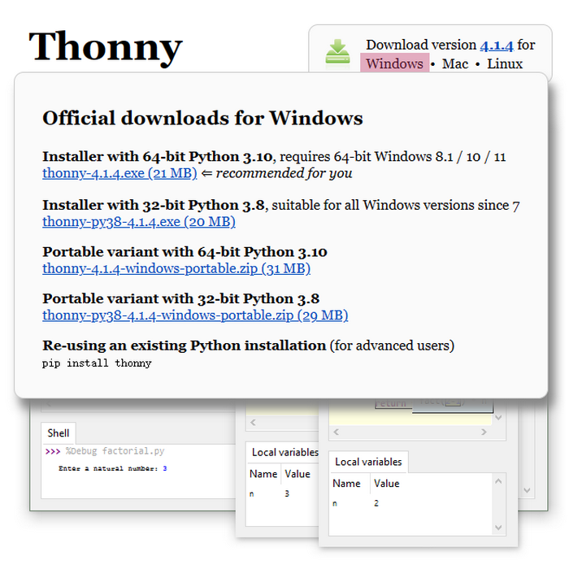

# KidsPico STEM Education Development Board


## What is KidsPico?	

KidsPico education development board is a teaching tool designed for students and beginners to develop interests and skills in science, technology, engineering and mathematics (STEM).

KidsPico uses a RP2040 microcontroller chip developed by Raspberry Pi. It boasts an ARM Cortex M0 + dual-core processor with a running frequency of 133MHz, a 264KB SRAM, a 2MB memory and 21 functional GPIO pins. In terms of software, you can choose the C/C++ SDK provided by Raspberry Pi or MicroPython for development, and it is equipped with complete development materials and tutorials, which can facilitate quick start development.


 Features:

※ Use the RP2040 microcontroller chip designed by Raspberry Pi

※ Equipped with dual-core ARM Cortex M0 + processor, running frequency is up to 133MHz flexible clock

※ The chip has built-in 264KB SRAM and 2MB on-chip Flash

※ Support USB1.1 host and device 

※ Support low-power sleep and hibernation mode

※ Can be recognized as mass storage via USB for drag-and-drop downloading

※ Up to 21 multi-function GPIO pins

※ Accurate on-chip clock and timer

※ Temperature sensor

※ 8 programmable I/O (PIO) state machines for custom peripheral device


## KidsPico Specifications

|       Microcontroller       | RP2040                                                       |
| :-------------------------: | ------------------------------------------------------------ |
|      Operating voltage      | 3.3V                                                         |
|        Input voltage        | USB power:3.3V,DC power:6-12V                                |
|      Digital I/O pins       | 21（Among them, 3 pins are used only for input）             |
|       PWM digital I/O       | 16                                                           |
|      Analog input pins      | The Raspberry Pi Pico board has 5 ADCs with a resolution of 12 bits, which are ADC0 (GP26), ADC1 (GP27), ADC2 (GP28), ADC3 (GP29), and ADC4. Among them, ADC3 (GP29) is used to measure VSYS on the Pico board; ADC4 is directly connected to the temperature sensor built into the RP2040. ADC_VREF can be connected to an external accurate voltmeter as the ADC reference. The ADC_GND pin serves as the ground reference point. |
|   DC current per I/O pin    | 20MA                                                         |
|        Flash memory         | 2MB                                                          |
|            SRAM             | 264KB                                                        |
|         Clock speed         | Up to 133MHz                                                 |
|        Total Current        | 400mA （max output） for USB power, 1.6A （max output） for DC power. |
|        Maximum Power        | 5.28W                                                        |
| Operating temperature range | -10~50 degrees Celsius                                       |
|           Weight            | 36g                                                          |


## KidsPico pinout


## What can KidsPico do?

KidsPico combines different types of sensors or modules to realize various applications such as STEM teaching, Internet of Things, intelligent control works, DIY creative works, etc.

1. Teaching application: It supports C/C++ and MicroPython languages, which can be used by students at different stages to learn programming;
2. Intelligent control application: It features ultra-high-performance main control, strong expansion ability, which is easy to realize various intelligent control works.
3. Application of DIY creative works: Combine input and output sensors and modules to quickly realize a variety of DIY creative works.


## How to use KidsPico?

### getting started with Arduino IDE

#### WINDOWS

##### Download Arduino IDE

When you get KidsIOT, you need to download Arduino IDE and driver firstly.

You could download Arduino IDE from the official website:

<https://www.arduino.cc/>, click the ***\*SOFTWARE\**** on the browse bar to enter download page, as shown below:


There are various versions of IDE for Arduino. Just download a version compatible with your system. Here we will show you how to download and install the windows version of Arduino IDE.


You can choose between the Installer (.exe) and the Zip packages. We suggest you use the first one that installs directly everything you need to use the Arduino Software (IDE), including the drivers. With the Zip package you need to install the drivers manually. The Zip file is also useful if you want to create a portable installation.


You just need to click JUST DOWNLOAD.

##### Install Pico board

1. Open Arduino IDE，then tap Tools→Board→Boards Manager...

   

2. In the search bar, type in **Pico** and search to install **Arduino Mbed OS RP2040 Boards**. 

   

3. If there is a security interface, please click “**Install**” . 

   

   

4. Tap Close.

   


##### Upload Pico firmware that is compatible with Arduino. 

1. Disconnect Raspberry Pi Pico to computer. Press and hold the white button(BOOTSEL) on Raspberry Pi Pico until the board is linked to PC. (Always remember to hold the button until connection is finished, otherwise firmware fails to be downloaded. )

   

2. Open Arduino IDE，Click **File** → **Examples** → **01.Basics** → **Blink**.

   

3. Click **Tools** → **Board** → **Arduino Mbed OS RP2040 Boards** → **Raspberry Pi Pico**.

   

4. Upload Sketch **Blink** to Pico.

   

   Then you will see below:

   

   The indicator on Pico board will blink. 

   

   Click **Tools** → **Port** → **COMx(Raspberry Pi Pico)**.

   In COMx, X varies from computers. So please select the correct COM port. In our demostration, the port is COM15.

   

   **NOTE**

   **A.** **Uploading Sketch via Arduino to Pico for the first time, no port selection required. Yet, every time after that, you need to check whether the port is selected; otherwise the download may fail.**
   
   **B.** **Sometimes, Pico board may not work due to loss of firmware. At this moment, please upload firmware again.**


#### MAC

##### Download Arduino IDE


The operation steps are similar to Windows systems.

**Success**：You have successfully installed the Pico Boards on Arduino IDE.


#### onboard OLED display

kidsPico is equipped with a 128x64 pixel OLED screen. Next, we will use the Arduino code to learn how to use this screen.

##### Installing an OLED Display Library

An OLED LCD display is integrated on the KisUno development board, the SSD1306 controller in the OLED display has flexible but complex drivers. To use the SSD1306 controller, extensive knowledge of memory addressing is required. Fortunately, the [SSD1306 library](https://github.com/adafruit/Adafruit_SSD1306) can be used to hide the complexities of the SSD1306 controller, allowing us to control the display with simple commands.

To install the library, navigate to Sketch > Include Library > Manage Libraries… Wait for the Library Manager to download the library index and update the list of installed libraries.


Filter your search by typing ‘adafruit ssd1306’. There should be a few entries. Look for SSD1306. Click on that entry and then choose Install.


This SSD1306 library is a hardware-specific library for low-level functions. To display graphics primitives such as points, lines, circles, and rectangles, it must be paired with the [Adafruit GFX Library](https://github.com/adafruit/Adafruit-GFX-Library). Install this library as well.


Internally, the SSD1306 library makes use of the [Adafruit Bus IO Library](https://github.com/adafruit/Adafruit_BusIO). So, look for Adafruit BusIO in the library manager and install it as well.


##### OLED Basic Drawings


Here’s a simple code that will do the following:

```c++
#include <Wire.h>
#include <Adafruit_GFX.h>
#include <Adafruit_SSD1306.h>

#define SCREEN_WIDTH 128 // OLED display width, in pixels
#define SCREEN_HEIGHT 64 // OLED display height, in pixels

// Declaration for SSD1306 display connected using I2C
#define OLED_RESET     -1 // Reset pin # (or -1 if sharing Arduino reset pin)
#define SCREEN_ADDRESS 0x3C
Adafruit_SSD1306 display(SCREEN_WIDTH, SCREEN_HEIGHT, &Wire, OLED_RESET);


void setup()
{
  Serial.begin(9600);
  
  // initialize the OLED object
  if(!display.begin(SSD1306_SWITCHCAPVCC, SCREEN_ADDRESS)) {
    Serial.println(F("SSD1306 allocation failed"));
    for(;;); // Don't proceed, loop forever
  }

  // Uncomment this if you are using SPI
  //if(!display.begin(SSD1306_SWITCHCAPVCC)) {
  //  Serial.println(F("SSD1306 allocation failed"));
  //  for(;;); // Don't proceed, loop forever
  //}

  // Clear the buffer.
  display.clearDisplay();

  // Draw Rectangle
  display.setTextSize(1);
  display.setTextColor(WHITE);
  display.setCursor(0,0);
  display.println("Rectangle");
  display.drawRect(0, 15, 60, 40, WHITE);
  display.display();
  delay(2000);
  display.clearDisplay();

  // Draw Filled Rectangle
  display.setTextSize(1);
  display.setTextColor(WHITE);
  display.setCursor(0,0);
  display.println("Filled Rectangle");
  display.fillRect(0, 15, 60, 40, WHITE);
  display.display();
  delay(2000);
  display.clearDisplay();

  // Draw Round Rectangle
  display.setTextSize(1);
  display.setTextColor(WHITE);
  display.setCursor(0,0);
  display.println("Round Rectangle");
  display.drawRoundRect(0, 15, 60, 40, 8, WHITE);
  display.display();
  delay(2000);
  display.clearDisplay();

  // Draw Filled Round Rectangle
  display.setTextSize(1);
  display.setTextColor(WHITE);
  display.setCursor(0,0);
  display.println("Filled Round Rectangl");
  display.fillRoundRect(0, 15, 60, 40, 8, WHITE);
  display.display();
  delay(2000);
  display.clearDisplay();

  // Draw Circle
  display.setTextSize(1);
  display.setTextColor(WHITE);
  display.setCursor(0,0);
  display.println("Circle");
  display.drawCircle(20, 35, 20, WHITE);
  display.display();
  delay(2000);
  display.clearDisplay();

  // Draw Filled Circle
  display.setTextSize(1);
  display.setTextColor(WHITE);
  display.setCursor(0,0);
  display.println("Filled Circle");
  display.fillCircle(20, 35, 20, WHITE);
  display.display();
  delay(2000);
  display.clearDisplay();

  // Draw Triangle
  display.setTextSize(1);
  display.setTextColor(WHITE);
  display.setCursor(0,0);
  display.println("Triangle");
  display.drawTriangle(30, 15, 0, 60, 60, 60, WHITE);
  display.display();
  delay(2000);
  display.clearDisplay();

  // Draw Filled Triangle
  display.setTextSize(1);
  display.setTextColor(WHITE);
  display.setCursor(0,0);
  display.println("Filled Triangle");
  display.fillTriangle(30, 15, 0, 60, 60, 60, WHITE);
  display.display();
  delay(2000);
  display.clearDisplay();
}

void loop() {
}
```

##### OLED Displays Text


```c++
#include <Wire.h>
#include <Adafruit_GFX.h>
#include <Adafruit_SSD1306.h>

#define SCREEN_WIDTH 128 // OLED display width, in pixels
#define SCREEN_HEIGHT 64 // OLED display height, in pixels
// Declaration for SSD1306 display connected using I2C
#define OLED_RESET     -1 // Reset pin # (or -1 if sharing Arduino reset pin)
#define SCREEN_ADDRESS 0x3C
Adafruit_SSD1306 display(SCREEN_WIDTH, SCREEN_HEIGHT, &Wire, OLED_RESET);
void setup()
{
  Serial.begin(9600);
  
  // initialize the OLED object
  if(!display.begin(SSD1306_SWITCHCAPVCC, SCREEN_ADDRESS)) {
    Serial.println(F("SSD1306 allocation failed"));
    for(;;); // Don't proceed, loop forever
  }
  // Clear the buffer.
  display.clearDisplay();

  // Display Text
  display.setTextSize(1);
  display.setTextColor(WHITE);
  display.setCursor(0,28);
  display.println("Hello world!");
  display.display();
  delay(2000);
  display.clearDisplay();

  // Display Inverted Text
  display.setTextColor(BLACK, WHITE); // 'inverted' text
  display.setCursor(0,28);
  display.println("Hello world!");
  display.display();
  delay(2000);
  display.clearDisplay();

  // Changing Font Size
  display.setTextColor(WHITE);
  display.setCursor(0,24);
  display.setTextSize(2);
  display.println("Hello!");
  display.display();
  delay(2000);
  display.clearDisplay();

  // Display Numbers
  display.setTextSize(1);
  display.setCursor(0,28);
  display.println(123456789);
  display.display();
  delay(2000);
  display.clearDisplay();

  // Specifying Base For Numbers
  display.setCursor(0,28);
  display.print("0x"); display.print(0xFF, HEX); 
  display.print("(HEX) = ");
  display.print(0xFF, DEC);
  display.println("(DEC)"); 
  display.display();
  delay(2000);
  display.clearDisplay();

  // Display ASCII Characters
  display.setCursor(0,24);
  display.setTextSize(2);
  display.write(3);
  display.display();
  delay(2000);
  display.clearDisplay();

  // Scroll full screen
  display.setCursor(0,0);
  display.setTextSize(1);
  display.println("Full");
  display.println("screen");
  display.println("scrolling!");
  display.display();
  display.startscrollright(0x00, 0x07);
  delay(2000);
  display.stopscroll();
  delay(1000);
  display.startscrollleft(0x00, 0x07);
  delay(2000);
  display.stopscroll();
  delay(1000);    
  display.startscrolldiagright(0x00, 0x07);
  delay(2000);
  display.startscrolldiagleft(0x00, 0x07);
  delay(2000);
  display.stopscroll();
  display.clearDisplay();

  // Scroll part of the screen
  display.setCursor(0,0);
  display.setTextSize(1);
  display.println("Scroll");
  display.println("some part");
  display.println("of the screen.");
  display.display();
  display.startscrollright(0x00, 0x00);
}
void loop() {
}
```


##### OLED Displays Bitmap


```c++
#include <SPI.h>
#include <Wire.h>
#include <Adafruit_GFX.h>
#include <Adafruit_SSD1306.h>

#define SCREEN_WIDTH 128 // OLED display width, in pixels
#define SCREEN_HEIGHT 64 // OLED display height, in pixels
// Declaration for SSD1306 display connected using I2C
#define OLED_RESET     -1 // Reset pin # (or -1 if sharing Arduino reset pin)
#define SCREEN_ADDRESS 0x3C
Adafruit_SSD1306 display(SCREEN_WIDTH, SCREEN_HEIGHT, &Wire, OLED_RESET);
// Declaration for SSD1306 display connected using software SPI:
//#define OLED_MOSI   9
//#define OLED_CLK   10
//#define OLED_DC    11
//#define OLED_CS    12
//#define OLED_RESET 13
//Adafruit_SSD1306 display(SCREEN_WIDTH, SCREEN_HEIGHT, OLED_MOSI, OLED_CLK, OLED_DC, OLED_RESET, OLED_CS);
// Bitmap of MarilynMonroe Imageconst 
const unsigned char MarilynMonroe [] PROGMEM = {
  0xff, 0xff, 0xff, 0xff, 0xff, 0xf8, 0x1f, 0xff, 0xff, 0xff, 0xff, 0xff, 0xff, 0xff, 0xff, 0xff, 
  0xff, 0xff, 0xff, 0xff, 0xff, 0xc0, 0x1f, 0xff, 0xff, 0xf0, 0x41, 0xff, 0xff, 0xff, 0xff, 0xff, 
  0xff, 0xff, 0xff, 0xff, 0xff, 0x80, 0x7f, 0xff, 0xff, 0xf8, 0x03, 0xff, 0xff, 0xff, 0xff, 0xff, 
  0xff, 0xff, 0xff, 0xff, 0xff, 0xf9, 0xff, 0xff, 0xff, 0xe0, 0x07, 0xff, 0xff, 0xff, 0xff, 0xff, 
  0xff, 0xff, 0xff, 0xff, 0xff, 0x87, 0xff, 0xff, 0xff, 0xf8, 0x03, 0xff, 0xff, 0xff, 0xff, 0xff, 
  0xff, 0xff, 0xff, 0xff, 0xff, 0x07, 0xff, 0xff, 0xff, 0xf8, 0x01, 0xf1, 0xff, 0xff, 0xff, 0xff, 
  0xff, 0xff, 0xff, 0xff, 0xff, 0x9f, 0xff, 0xff, 0xff, 0xf8, 0x00, 0xf8, 0xff, 0xff, 0xff, 0xff, 
  0xff, 0xff, 0xff, 0xff, 0xff, 0xbf, 0xff, 0xff, 0xff, 0xfc, 0x02, 0x78, 0x7f, 0xff, 0xff, 0xff, 
  0xff, 0xff, 0xff, 0xff, 0xff, 0xfc, 0x3f, 0xff, 0xff, 0xfe, 0x03, 0x7c, 0x1f, 0xff, 0xff, 0xff, 
  0xff, 0xff, 0xff, 0xff, 0xff, 0xf0, 0x07, 0xff, 0xff, 0xfe, 0x01, 0xfe, 0x1f, 0xff, 0xff, 0xff, 
  0xff, 0xff, 0xff, 0xff, 0xfd, 0xe0, 0x03, 0xff, 0xff, 0xfc, 0x00, 0xfe, 0x0f, 0xff, 0xff, 0xff, 
  0xff, 0xff, 0xff, 0xff, 0xfe, 0x87, 0xe0, 0xff, 0xff, 0xfc, 0x00, 0x06, 0x07, 0xff, 0xff, 0xff, 
  0xff, 0xff, 0xff, 0xff, 0xfc, 0x1f, 0xf9, 0xff, 0xff, 0xfc, 0x00, 0x02, 0x07, 0xff, 0xff, 0xff, 
  0xff, 0xff, 0xff, 0xff, 0xf8, 0x1f, 0xff, 0xff, 0xff, 0xfc, 0x00, 0xc3, 0xc3, 0xff, 0xff, 0xff, 
  0xff, 0xff, 0xff, 0xff, 0xf0, 0x3f, 0xff, 0xff, 0xe0, 0x0c, 0x00, 0xe7, 0x81, 0xff, 0xff, 0xff, 
  0xff, 0xff, 0xff, 0xff, 0xf0, 0x0f, 0xff, 0xff, 0xe0, 0x02, 0x00, 0x02, 0x00, 0xff, 0xff, 0xff, 
  0xff, 0xff, 0xff, 0xff, 0xf0, 0x0f, 0xff, 0xff, 0xe0, 0x01, 0x00, 0x00, 0x00, 0x3f, 0xff, 0xff, 
  0xff, 0xff, 0xff, 0xff, 0x80, 0x00, 0x3f, 0xff, 0xff, 0xe0, 0x00, 0x00, 0x1e, 0x3f, 0xff, 0xff, 
  0xff, 0xff, 0xff, 0xfc, 0x00, 0x00, 0x0f, 0xff, 0x3f, 0xf8, 0x00, 0x18, 0x7f, 0x1f, 0xff, 0xff, 
  0xff, 0xff, 0xff, 0xf8, 0x01, 0x80, 0x03, 0xfc, 0x3f, 0xfc, 0x00, 0x70, 0xfe, 0x1f, 0xff, 0xff, 
  0xff, 0xff, 0xff, 0xf0, 0x43, 0xff, 0xff, 0xf8, 0x7f, 0xf8, 0x00, 0x00, 0x7e, 0x1f, 0xff, 0xff, 
  0xff, 0xff, 0xff, 0xe0, 0x07, 0xff, 0xff, 0xf0, 0xff, 0xfc, 0x00, 0x00, 0x7c, 0x3f, 0xff, 0xff, 
  0xff, 0xff, 0xff, 0xe0, 0x0f, 0xff, 0xff, 0xf1, 0xef, 0xf8, 0x00, 0x01, 0xfc, 0x3f, 0xff, 0xff, 
  0xff, 0xff, 0xff, 0xe4, 0xff, 0xff, 0xff, 0xf3, 0x80, 0xa0, 0x00, 0x07, 0xfc, 0xaf, 0xff, 0xff, 
  0xff, 0xff, 0xff, 0xec, 0x5f, 0xff, 0xff, 0xe7, 0xf0, 0x00, 0x00, 0x03, 0xfe, 0xdf, 0xff, 0xff, 
  0xff, 0xff, 0xff, 0xee, 0x7f, 0xff, 0xff, 0xc7, 0xf8, 0x00, 0x00, 0x03, 0xff, 0xdf, 0xff, 0xff, 
  0xff, 0xff, 0xff, 0xfe, 0x7f, 0xff, 0xf7, 0xc7, 0xff, 0x06, 0x00, 0x03, 0xff, 0xbf, 0xff, 0xff, 
  0xff, 0xff, 0xff, 0xfe, 0x5f, 0xff, 0xc7, 0x07, 0xff, 0x80, 0x00, 0x07, 0xdb, 0xbf, 0xff, 0xff, 
  0xff, 0xff, 0xff, 0xee, 0xff, 0xff, 0x80, 0x03, 0xff, 0xc0, 0x00, 0x03, 0xc3, 0x0f, 0xff, 0xff, 
  0xff, 0xff, 0xff, 0xfe, 0xff, 0xff, 0x98, 0x03, 0xff, 0xf8, 0x00, 0x07, 0xe0, 0x0f, 0xff, 0xff, 
  0xff, 0xff, 0xff, 0xef, 0xff, 0xff, 0xf8, 0x01, 0xff, 0xfc, 0x01, 0x07, 0xfc, 0x1f, 0xff, 0xff, 
  0xff, 0xff, 0xff, 0xcf, 0xef, 0xff, 0xff, 0xe1, 0xff, 0xfc, 0x01, 0x07, 0xf8, 0x1f, 0xff, 0xff, 
  0xff, 0xff, 0xff, 0x9f, 0xff, 0xff, 0x7f, 0xf1, 0xff, 0xf8, 0x02, 0x07, 0x88, 0x3f, 0xff, 0xff, 
  0xff, 0xff, 0xff, 0xcf, 0xef, 0xf8, 0x0f, 0xff, 0xff, 0xe0, 0x00, 0x07, 0x84, 0x3f, 0xff, 0xff, 
  0xff, 0xff, 0xff, 0xe7, 0xef, 0xf0, 0x04, 0x7f, 0xff, 0xc0, 0x00, 0x07, 0x84, 0x7f, 0xff, 0xff, 
  0xff, 0xff, 0xff, 0x3f, 0xff, 0xe0, 0x00, 0x1f, 0xff, 0x80, 0x00, 0x06, 0x04, 0xff, 0xff, 0xff, 
  0xff, 0xff, 0xff, 0x3f, 0x7f, 0xe1, 0xf0, 0x07, 0xff, 0x80, 0x00, 0x07, 0x06, 0xff, 0xff, 0xff, 
  0xff, 0xff, 0xff, 0xff, 0xff, 0xc3, 0xfe, 0x03, 0xff, 0x00, 0x00, 0x03, 0x80, 0xff, 0xff, 0xff, 
  0xff, 0xff, 0xff, 0xf2, 0x3f, 0xc6, 0x7f, 0x81, 0xce, 0x00, 0x00, 0x01, 0xc1, 0xff, 0xff, 0xff, 
  0xff, 0xff, 0xff, 0xe0, 0x3f, 0xc0, 0x07, 0xc1, 0xfe, 0x00, 0x00, 0x0d, 0xc0, 0x7f, 0xff, 0xff, 
  0xff, 0xff, 0xff, 0xe0, 0x3f, 0xc0, 0x01, 0xe0, 0xfc, 0x00, 0x00, 0x0f, 0xc0, 0x7f, 0xff, 0xff, 
  0xff, 0xff, 0xff, 0xc0, 0x3f, 0xc0, 0x00, 0x50, 0xfc, 0x00, 0x00, 0x0e, 0xc0, 0xff, 0xff, 0xff, 
  0xff, 0xff, 0xff, 0xc0, 0x3f, 0xc0, 0x00, 0x18, 0xf8, 0x00, 0x00, 0x0e, 0xc1, 0xff, 0xff, 0xff, 
  0xff, 0xff, 0xff, 0xc0, 0x3f, 0xc0, 0x00, 0x00, 0xf8, 0x00, 0x00, 0x66, 0x81, 0xff, 0xff, 0xff, 
  0xff, 0xff, 0xff, 0xc0, 0x1f, 0xc7, 0x80, 0x00, 0xf8, 0x00, 0x01, 0xe0, 0x00, 0xff, 0xff, 0xff, 
  0xff, 0xff, 0xff, 0xc0, 0x1f, 0xc1, 0xe0, 0x01, 0xf8, 0x00, 0x03, 0xf0, 0x01, 0xff, 0xff, 0xff, 
  0xff, 0xff, 0xff, 0x80, 0x1f, 0xc0, 0x3e, 0x03, 0xf0, 0x00, 0x00, 0xe0, 0x03, 0xff, 0xff, 0xff, 
  0xff, 0xff, 0xff, 0x00, 0x1f, 0xe0, 0xe0, 0x03, 0xf2, 0x00, 0x00, 0xc0, 0x03, 0xff, 0xff, 0xff, 
  0xff, 0xff, 0xff, 0x80, 0x1f, 0xf0, 0x00, 0x07, 0xe6, 0x00, 0x00, 0xc0, 0x03, 0xff, 0xff, 0xff, 
  0xff, 0xff, 0xff, 0x80, 0x1f, 0xff, 0x00, 0x1f, 0xee, 0x00, 0x00, 0x80, 0x07, 0xff, 0xff, 0xff, 
  0xff, 0xff, 0xff, 0xb8, 0x0f, 0xff, 0xf0, 0x3f, 0xdc, 0x00, 0x00, 0x00, 0x0f, 0xff, 0xff, 0xff, 
  0xff, 0xff, 0xff, 0xbc, 0x0f, 0xff, 0xff, 0xff, 0xdc, 0x00, 0x00, 0x00, 0x0f, 0xff, 0xff, 0xff, 
  0xff, 0xff, 0xff, 0x9e, 0x0f, 0xff, 0xff, 0xff, 0xf8, 0x00, 0x00, 0x00, 0x1f, 0xff, 0xff, 0xff, 
  0xff, 0xff, 0xff, 0x08, 0x0f, 0xff, 0xff, 0xff, 0x70, 0x00, 0x00, 0x00, 0x1f, 0xff, 0xff, 0xff, 
  0xff, 0xff, 0xff, 0x00, 0x0b, 0xff, 0xff, 0xfe, 0xe0, 0x00, 0x00, 0x00, 0x1f, 0xff, 0xff, 0xff, 
  0xff, 0xff, 0xff, 0x00, 0x0b, 0xff, 0xff, 0xf9, 0xc0, 0x00, 0x00, 0x00, 0x3f, 0xff, 0xff, 0xff, 
  0xff, 0xff, 0xff, 0x3c, 0x09, 0xff, 0xff, 0xf1, 0x80, 0x00, 0x00, 0x00, 0x7f, 0xff, 0xff, 0xff, 
  0xff, 0xff, 0xff, 0x1e, 0x08, 0x3f, 0xff, 0xc0, 0x00, 0x00, 0x00, 0x00, 0x7f, 0xff, 0xff, 0xff, 
  0xff, 0xff, 0xff, 0x1f, 0x08, 0x03, 0xff, 0x00, 0x00, 0x00, 0x00, 0x00, 0x7f, 0xff, 0xff, 0xff, 
  0xff, 0xff, 0xff, 0x00, 0x08, 0x00, 0x00, 0x00, 0x00, 0x00, 0x00, 0x00, 0x1f, 0xff, 0xff, 0xff, 
  0xff, 0xff, 0xff, 0x80, 0x1c, 0x00, 0x00, 0x00, 0x00, 0x00, 0x00, 0x00, 0x1f, 0xff, 0xff, 0xff, 
  0xff, 0xff, 0xff, 0xce, 0x1c, 0x00, 0x00, 0x00, 0x00, 0x00, 0x00, 0x00, 0x1f, 0xff, 0xff, 0xff, 
  0xff, 0xff, 0xff, 0xfe, 0x1c, 0x00, 0x00, 0x00, 0x00, 0x00, 0x00, 0x00, 0x3f, 0xff, 0xff, 0xff, 
  0xff, 0xff, 0xff, 0xff, 0x7e, 0x00, 0x00, 0x00, 0x00, 0x00, 0x00, 0x00, 0x7f, 0xff, 0xff, 0xff
};
void setup()
{
  Serial.begin(9600);
  
  // initialize the OLED object
  if(!display.begin(SSD1306_SWITCHCAPVCC, SCREEN_ADDRESS)) {
    Serial.println(F("SSD1306 allocation failed"));
    for(;;); // Don't proceed, loop forever
  }

  // Uncomment this if you are using SPI
  //if(!display.begin(SSD1306_SWITCHCAPVCC)) {
  //  Serial.println(F("SSD1306 allocation failed"));
  //  for(;;); // Don't proceed, loop forever
  //}

  // Clear the buffer.
  display.clearDisplay();

  // Display bitmap
  display.drawBitmap(0, 0,  MarilynMonroe, 128, 64, WHITE);
  display.display();

  // Invert Display
  //display.invertDisplay(1);
}
void loop() {
}
```

### Getting started with microPython

#### Windows System

**For Windows 10**

Software download link：[Thonny software official website](https://thonny.org)

When the mouse touches the location indicated by the arrow, the official Windows download version will appear.




#### MAC System

Please refer to the Windows system.


##### Software Installation

Thonny application installation supports two installation methods：

- Install Thonny+Python bundle package

  The essence of this method is to package the Python environment and Thonny together, which can be installed and used with one click. It is recommended for novices to use this method. There are two ways to install the bundled package:

  - Installer installation 

    

  - No installation required 

    

- Install Thonny

  Thonny applications essentially exist in the form of python packages. When users already have a python environment, they can install Thonny separately through `pip install thonny`. This approach is more suitable for developers.

  

Please download the corresponding version of the compressed package according to your needs.

###### Installer Installation

Please select the corresponding program to download according to your operating system. Here we take the installation program `Installer with 64-bit Python 3.10` in the <span style="background:#ff0;color:#000">64bit Windows 10</span> environment as an example.

（1）Double-click , then choose **Install for me only** .


（2） Tap **Next**.


（3）Select  **I accept the agreement** and **Next**.


（4）The installation path of Thonny software is installed on the C drive by default. Click Browse... , you can select another installation location, then click **Next**.


（5）Tap **Next**.


（6）Click **Create desktop icon** and **Next**.


（7）Click Install.


（8）Click“**Finish**”.


（9）Double-click the desktop icon of Thonny software, we can choose the language.


（10）The installation is complete.


###### No installation required 

Please select the corresponding program to download according to your operating system. Here we take the installation program `Portable variant with 64-bit Python 3.10` in the <span style="background:#ff0;color:#000">64bit Windows 10</span> environment as an example.

（1）After downloading it, unzip it and double-clickto choose the language.


（2）The installation is complete.


（3）For ease of use, you can create a shortcut to the desktop. Right-click , select **Send to** and **Desktop Shortcut**.


Then you will view：

---

##### Burn firmware

First, press and hold the BOOT button on the kidspico main board, and use the USB cable to connect to the computer port, then release the BOOT button, a large-capacity removable hard drive will appear on the computer. Then copy the firmware  to the removable hard drive.


Open the Thonny software, then select **MicroPython (Raspberry Pi Pico)**.


---

##### Software introduction

###### Interface

Tap **View**  and**Files**  to open file path management.


###### Toolbar introduction


|        Button         |       Function       |
| :-------------------: | :------------------: |
|  |     Create file      |
|  |      Open file       |
|  |      Save file       |
|  |       Run file       |
|  |      Debug file      |
|  |      Step over       |
|  |      Step into       |
|  |       Step out       |
|  |        Resume        |
|  | Stop/Restart backend |

---

##### Test 

###### Test Shell Command

Enter the following code in the Shell window.

```python
print('hello world')
```


Press the Enter key on the keyboard, and the Shell window prints out **hello world**.


---

###### Test running online

Tapand  **This computer**.


Open **1.5HelloWorld.py**  .


Click  to see the output in the Shell window.


---

#### onboard OLED display

kidsPico is equipped with a 128x64 pixel OLED screen. Next, we will use the Arduino code to learn how to use this screen.

Open the rpi-pico-ssd1306 folder.


Upload the two files imgfile.py and ssd1306.py to KidsPico.

Open the files.


Save them to KidsPico.


Open main.py and click Run.


Display：

